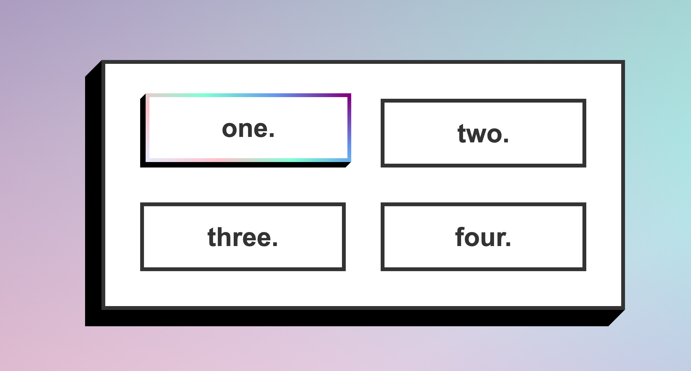

# Stylzed Button One

A Stylized button using incrememnting box shadows to display a shadow effect. 

Uses border-image to display a gradient border. 

On hover, it also utilized keyframes and animation to display a rotating/animated border and a transition: translate to push the position of the button to the upper right.

